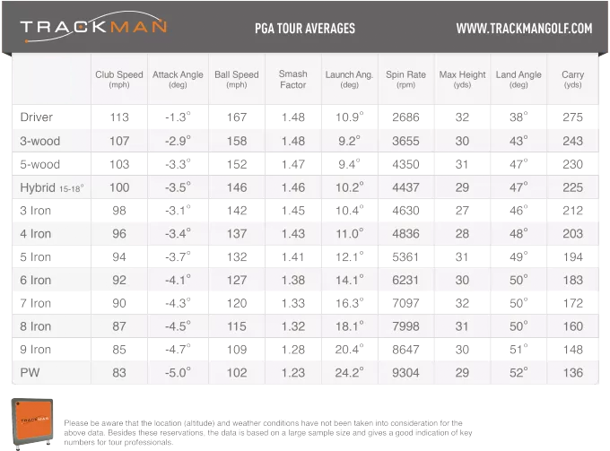

#### Accueil: [Page 1](index.md)  Trajectoire simplifiée: [Page2](2.md)

# Trajectoire simplifiée
Celle-ci est influencée par des paramètres initiaux qui sont la vitesse initiale et l'angle initiale.

## Paramètres initiaux
### Vitesse initiale influencée par la longueur du club
Au golf, les clubs varient notamment selon leur longueur. Or cette variation de longueur fait varier la vitesse initiale. Plus le club est long, plus le bras de levier l'est aussi et plus la tête de club ira vite.
Mais lorsqu’un joueur tape un coup de golf, peu importe la longueur du club, ses mains auront toujours la même vitesse et tourneront comme un balancier (swing) dans un mouvement circulaire. On dit d’ailleurs qu’il faut toujours faire le même coup sans se soucier de ce qu’on a dans les mains. Si on applique ça à la physique, cela signifie que la vitesse angulaire est toujours la même, la longueur du club modifie simplement la vitesse de la tête du club. A partir de cette vitesse on pourra trouver ce qu’on cherche c’est-à-dire la vitesse initiale de la balle. On va donc choisir la vitesse d’un club commun : le fer 7 qui nous donnera la vitesse angulaire moyenne qu’on utilisera ensuite pour connaître la variation de vitesse selon la longueur des différents clubs avec la formule v=R donnée par la démonstration en annexe.

#### Etablissement de la vitesse angulaire
Avec cette formule et la vitesse qu’ont les pros avec leur fer 7 on peut déterminer cette vitesse angulaire. On sait qu’avec un fer 7 la vitesse du club est d’environ 40m/s et mesure 135cm. 
On a donc : ω=vR ⇔ ω=40/0,93= 43
#### Etablissement de la vitesse de différents clubs à l'impact 

| Club        | Calcul         | Résultat    |
| ----------- | : ------------:| ----------: |
| Fer 5       |  0,96x43       | 41m/s=91mph |
| Fer 7       | 40m/s          | 89 mph      |
| Fer 9       | 0,91x43        | 39m/s=87mph |
| Sandwedge   | 0,89x43        | 38m/s=85mph |

On vient de déterminer la vitesse du club à l’impact mais ce dont on a besoin est la vitesse initiale de la balle qui n’est pas la même. Pour faire le lien entre ces deux vitesses il existe cette formule qui nous permet d'arriver a ça:
         
| Club        | Vitesse du club | Vitesse de la balle |
| ----------- | : -------------:| ------------------: |
| Fer 5       | 41m/s=91mph     | 127 mph=57 m/s      |
| Fer 7       | 40m/s = 89mph   | 118 mph=53 m/s      |
| Fer 9       | 39m/s=87mph     | 104 mph=46 m/s      |
| Sandwedge   | 38m/s=85mph     | 77 mph=34 m/s       |

Ces variations de vitesse trouvées par le calcul correspondent dans les grandes lignes aux valeurs mesurées chez un golfeur professionnel dont voici les données ci-dessous.

[Link](url) and 

### Angle initial influcencé par la forme du club

Voyons maintenant ce que modifie la forme du club. Lorsque le club arrive à l’impact avec un loft différent, l’angle d’impact n’est donc pas le même. Calculons donc cet angle d’impact : 
- Cet angle se compose de deux autres angles : le loft et l’angle que fait le club avec la verticale en arrivant sur le sol. Il suffit simplement de soustraire l’angle du club au loft et on obtient cet angle initial. 

Ces angles sont représentés sur le graphique ci-dessous :
- Angle θo = angle de la face du club (loft) - angle avec lequel le club arrive par rapport à la perpendiculaire
- Ici le cas du Sandwedge est représenté. On a un loft de 54°, l’angle du club est de 24° et donc l’angle de tir de 30°. (54-24)

