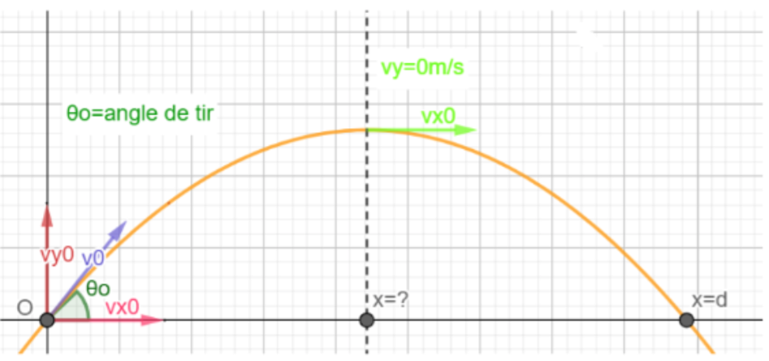
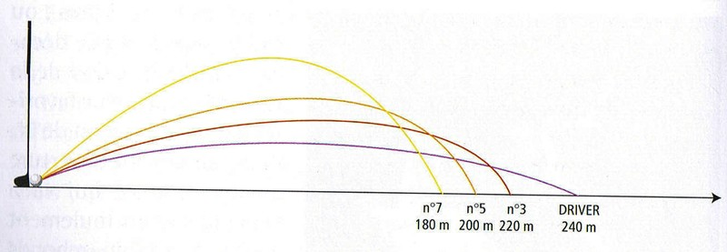

## Physique du Golf

Le but de ce travail est de trouver la trajectoire d’une balle de golf. Il faut donc savoir de quoi
dépend cette trajectoire.

**Elle dépend :**
- Des paramètres initiaux
  - Vitesse initiale
  - Angle initial
- Des paramètreslors du vol
  - Le poids
  - Le frottement
  - La force de Magnus

### Caractéristiques d'un club
Un club est caractérisé par deux choses :
* sa longueur
* son angle d'ouverture (loft)
```

 voici un exemple de quelques clubs
 ```

 

| Club        | Longueur       | Loft        |
| ----------- | : ------------:| ----------: |
| Fer 5       | 0,96 m         | 22°         |
| Fer 7       | 0,94 m         | 29°         |
| Fer 9       | 0,91 m         | 38°         |
| Sandwedge   | 0,89 m         | 54°         |


```
Nous séparerons ce travail en deux parties: tout d'abord on simplifiera la trajectoire en une trajectoire de balistique en terrain plat et ensuite on parlera de l'influence de l'air.

```
**Voici la trajectoire simplifiée**
[Link](url) and 



**Voici la trajectoire réelle**
[Link](url) and 


